# HIV Data Management System — Kinshasa Health Centers

> Web-based medical information system for HIV patient data collection, monitoring and reporting across health centers in Kinshasa, DR Congo.

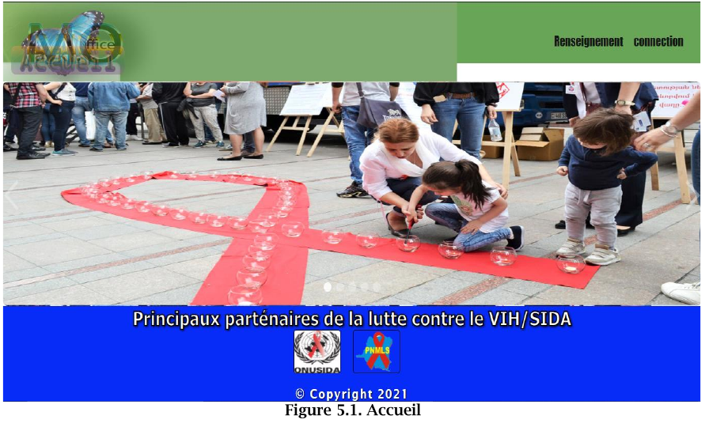

## Project Overview

This legacy PHP/MySQL web application was developed as a final-year academic project to support the digitization of HIV patient data collection and reporting in Kinshasa health centers.

The system helps health workers register patient information, consult follow-up records, manage health units, and generate statistical reports for monitoring HIV-related indicators.

**Academic context:** Travail de fin de cycle (TFC), Applied Computer Science, University of Kinshasa, 2019-2020.

## Problem Addressed

Many health facilities relied on paper forms for collecting and aggregating HIV-related data. This approach increased the risk of data loss, manual calculation errors, delayed reporting, and limited visibility at commune or health-zone level.

The goal of the application is to centralize data entry, automate reporting, and make key indicators easier to consult.

## Main Features

- Patient registration and follow-up forms
- Health unit and reference data management
- Nurse, reporting officer, and reference officer interfaces
- Statistical chart generation with JPGraph
- PDF-style report generation with FPDF
- District/commune-oriented reporting workflow
- Interfaces for Kinshasa health zones and communes

## Modèle de données

### Modèle Conceptuel des Données (MCD)
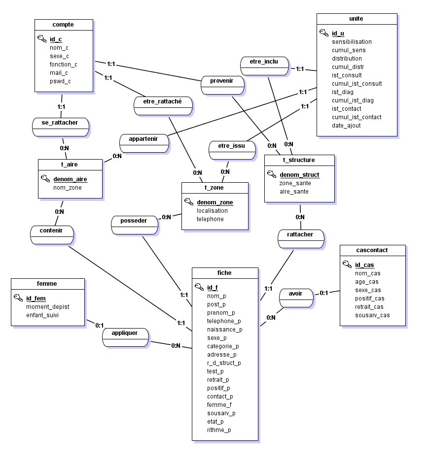

### Modèle Logique des Données (MLD)
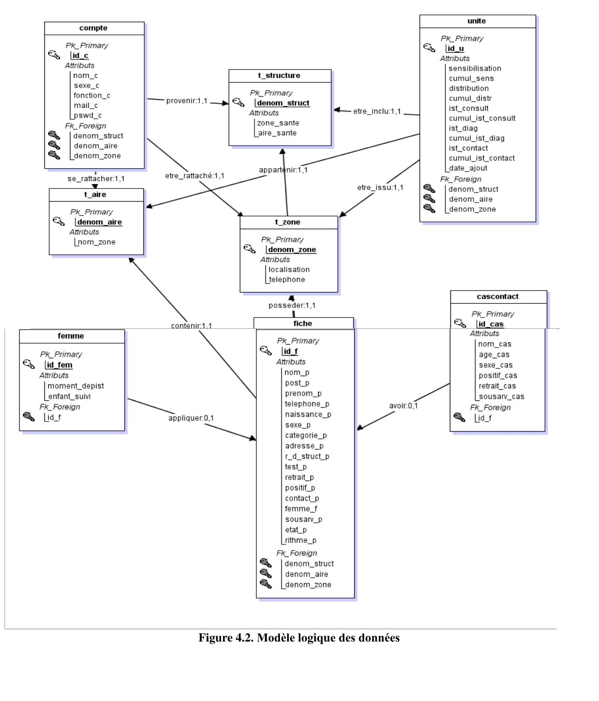

### Modèle Physique des Données (MPD)
Voir [modele_physique_donnees_MPD.md](modele_physique_donnees_MPD.md) pour le détail des 8 tables
(`compte`, `unite`, `t_structure`, `t_aire`, `t_zone`, `fiche`, `femme`, `cascontact`) avec types,
clés primaires/étrangères et contraintes.

## Captures d'écran

### Page d'accueil
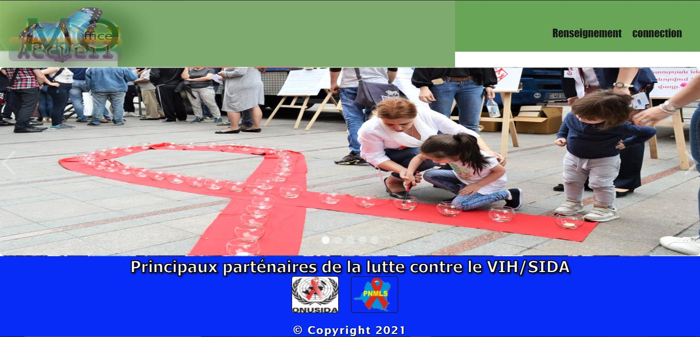

### Renseignement des zones de santé
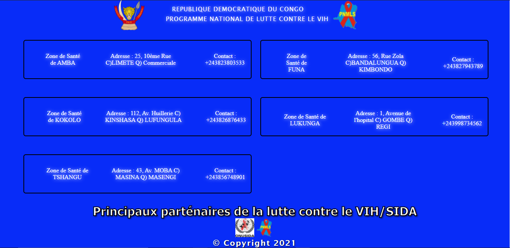

### Connexion
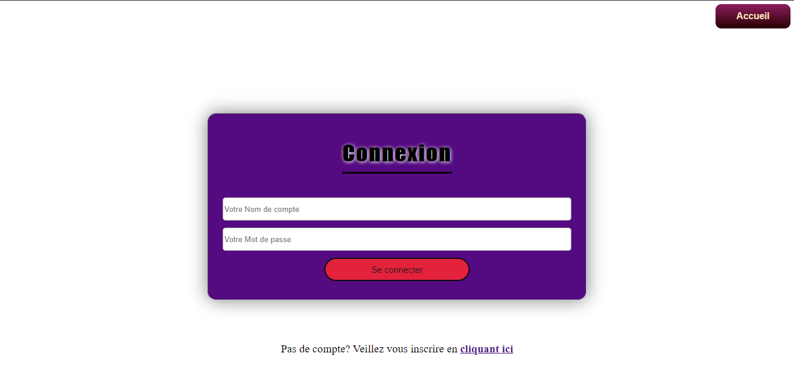

### Inscription
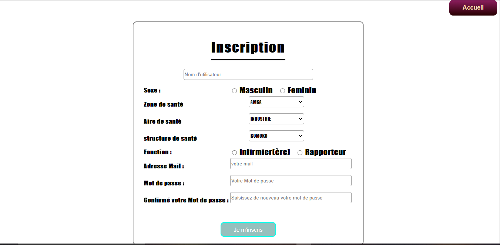

### Menu infirmier (saisie des données)
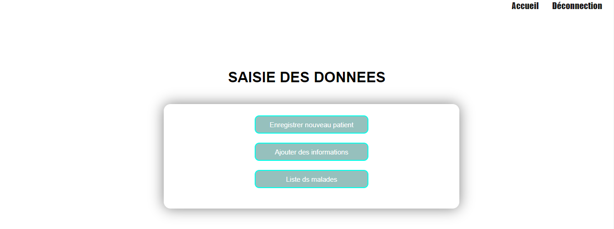

### Fiche patient
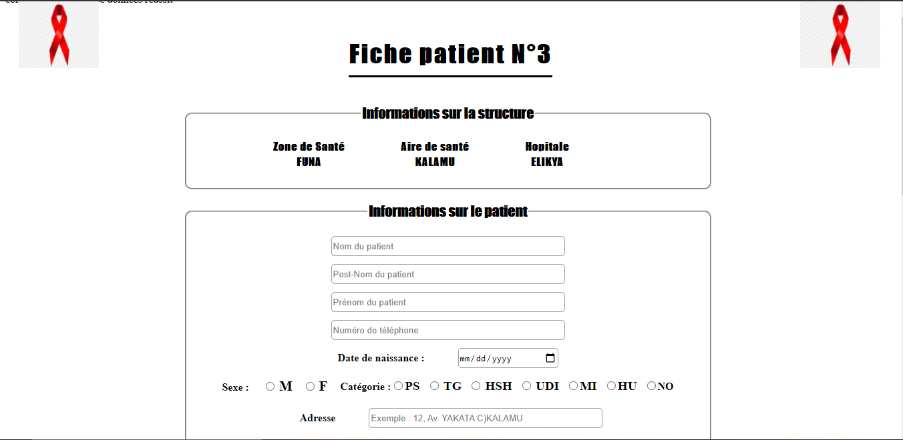

### Données de l'unité / structure
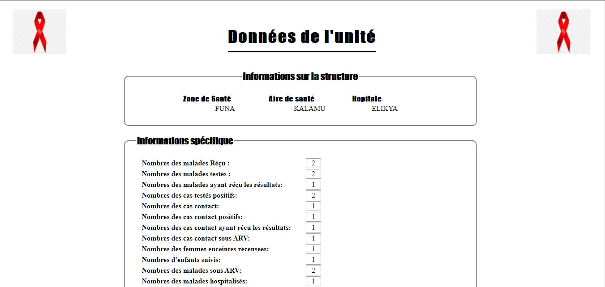

### Export PDF — liste des malades
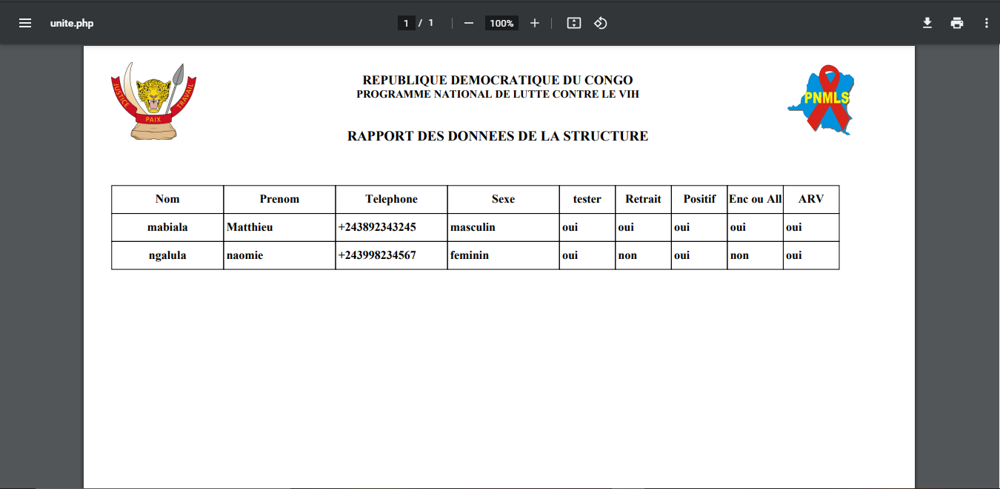

### Rapportage structure (côté rapporteur)
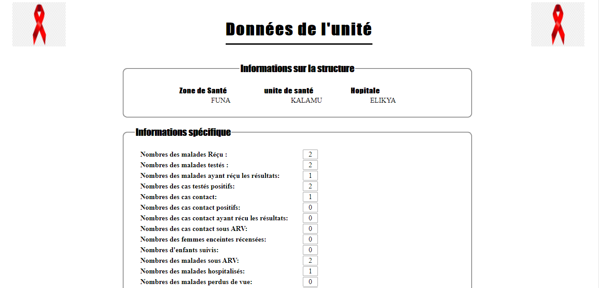

### Export PDF — état de la structure
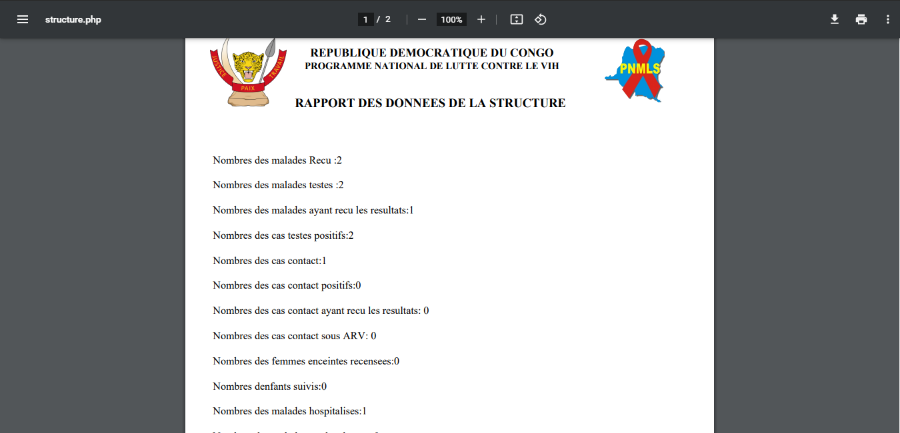

### Graphe de rapportage
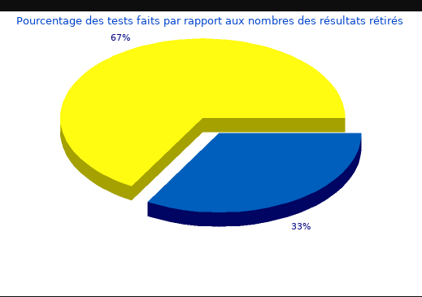
## Technologies Used

| Category | Tools |
|---|---|
| Backend | PHP |
| Database | MySQL |
| Data access | PDO |
| Charts | JPGraph |
| Reports | FPDF |
| Frontend | HTML, CSS |
| Server | Apache / WAMP / LAMP |

## Repository Structure

```text
vih-kinshasa-system/
├── README.md
├── .gitignore
├── screenshots/
    ├── 01_modele_conceptuel_donnees_MCD.png
    ├── 02_modele_logique_donnees_MLD.png
    ├── 03_page_accueil.png
    ├── 04_page_renseignement_zones_sante.png
    ├── 05_page_connexion.png
    ├── 06_page_inscription.png
    ├── 07_menu_infirmier.png
    ├── 08_fiche_patient.png
    ├── 09_page_structure_donnees_unite.png
    ├── 10_export_pdf_liste_malades.png
    ├── 11_rapportage_structure.png
    ├── 12_export_pdf_etat_structure.png
    ├── 13_graphe_rapportage.png
├── docs/
│   └── database-notes.md
├── pdf_reports/
│   ├── fpdf.php
│   ├── font/
│   └── *.php
└── src/
    ├── page 1.html
    ├── connection.php
    ├── inscription.php
    ├── fiche.php
    ├── unite.php
    ├── infirmier.php
    ├── rapporteur.php
    ├── reference.php
    ├── graph1.php
    ├── graph2.php
    ├── graph3.php
    ├── graph4.php
    ├── *.css
    ├── images
    └── src/              # JPGraph library files used by chart scripts
```

## Local Installation

1. Install Apache, PHP, and MySQL using WAMP, XAMPP, or LAMP.
2. Copy the `src/` folder into your local web server directory, for example:

```bash
C:/wamp64/www/vih-kinshasa-system/
```

or on Linux:

```bash
/var/www/html/vih-kinshasa-system/
```

3. Create a MySQL database named:

```sql
vihsida
```

4. Configure the database credentials in the PHP files if needed. The original academic version uses local development credentials:

```php
$serveur = "localhost";
$login = "root";
$pass = "";
```

5. Open the application in the browser:

```text
http://localhost/vih-kinshasa-system/page%201.html
```

## Important Note

This repository is a cleaned portfolio version of an academic legacy project. The original archive contained large compressed files, unrelated assets, and academic documents that were intentionally excluded from this GitHub-ready version.

The complete database dump was not included in the original cleaned source. See `docs/database-notes.md` for guidance before attempting a full runtime deployment.

## Skills Demonstrated

- PHP web application development
- MySQL database-driven interfaces
- Healthcare data collection workflow design
- Report generation with FPDF
- Chart generation with JPGraph
- HTML/CSS interface development
- Academic software documentation

## Author

**Manassé Makuikila Lusaku**  
Applied Computer Science — University of Kinshasa / RTU MIREA  

## License

MIT License
